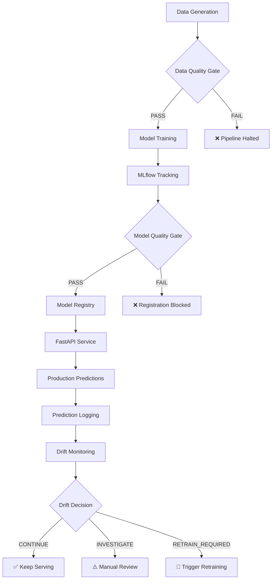

# ReliableML: A Reproducible CI/CD Pipeline for Machine Learning Systems

[]()
[]()
[]()

**Master's Thesis Research Prototype**

> **Research Question:** How can automated data-quality gates and data-drift monitoring improve the reliability and reproducibility of continuous machine-learning deployment compared with a conventional CI/CD pipeline?

## 📖 Overview

ReliableML is a complete, runnable, local-first thesis prototype that demonstrates the value of integrating automated quality gates and drift monitoring into ML deployment pipelines. This project implements and compares two approaches:

1. **Baseline Pipeline**: Traditional ML workflow without quality gates or formal tracking
2. **Proposed MLOps Pipeline**: Production-grade workflow with:
   - Automated Pandera data-quality validation
   - MLflow experiment tracking and model registry
   - Evidently data-drift monitoring
   - Blocking quality gates preventing invalid deployments
   - Full reproducibility verification

## 🏗️ System Architecture



## 🚀 Quick Start

### Prerequisites

- **Python 3.11 or 3.12** (3.14 also works but 3.11/3.12 recommended)
- **Docker & Docker Compose** (optional, for containerized services)
- **Git** (for version control)
- **8GB RAM minimum** (for local training and services)

### Installation

```bash
# Clone or navigate to the project directory
cd reliableml

# Create virtual environment and install dependencies
make setup

# Activate the environment
# On Windows (Git Bash):
source .venv/Scripts/activate
# On Linux/macOS:
source .venv/bin/activate
```

### Generate Data

```bash
# Generate all scenarios (clean, quality_failure, mild_drift, severe_drift, performance_degradation)
make data

# Or generate just clean data
make data-clean
```

### Run Baseline Pipeline

```bash
# Run traditional ML pipeline (no quality gates)
make baseline

# Output: ./reports/baseline_run_summary.json
# Model artifact: ./artifacts/baseline_model.pkl
```

### Run Proposed MLOps Pipeline

```bash
# Start MLflow tracking server (in separate terminal)
make mlflow
# Access MLflow UI: http://localhost:5000

# Run proposed pipeline with quality gates and tracking
make proposed

# Output: ./reports/proposed_pipeline_summary.json
# MLflow run ID logged with full lineage
```

### Start Model Serving

```bash
# Option 1: Local development server
make serve
# Access API docs: http://localhost:8000/docs

# Option 2: Docker Compose (MLflow + Prediction Service)
make compose-up
# Access:
#   - MLflow UI: http://localhost:5000
#   - API docs: http://localhost:8000/docs

# Stop services
make compose-down
```

### Test API Endpoints

```bash
# Check health
curl http://localhost:8000/health

# Make prediction
curl -X POST http://localhost:8000/predict \
  -H "Content-Type: application/json" \
  -d '{
    "store_id": "store_001",
    "product_category": "Electronics",
    "promotion_flag": 1,
    "price": 149.99,
    "inventory_level": 250,
    "competitor_price": 159.99,
    "temperature": 22.5,
    "day_of_week": 5,
    "month": 7,
    "previous_day_sales": 85.0
  }'
```

### Simulate Production and Monitor Drift

```bash
# Simulate clean production data
make simulate-clean

# Simulate severe drift scenario
make simulate-severe-drift

# Run drift monitoring against reference baseline
make monitor-severe

# Output:
#   - HTML report: ./reports/drift_report.html
#   - JSON summary: ./reports/drift_summary.json
#   - Decision: ./reports/drift_decision.json
```

### Verify Reproducibility

```bash
# Run proposed pipeline twice with identical seed and compare results
make reproduce

# Output: ./reports/reproducibility_report.json
# Exit code 0 if reproducible, 1 if not
```

### Export Thesis Comparison Metrics

```bash
# Generate comparison tables and markdown summary
make metrics

# Output:
#   - ./reports/comparison_metrics.csv
#   - ./reports/comparison_summary.md
#   - ./reports/baseline_metrics.json
#   - ./reports/proposed_metrics.json
```

### Run Full Experiment

```bash
# Execute complete thesis experiment pipeline
make full-experiment
```

## 📂 Project Structure

```
reliableml/
├── configs/                    # YAML configuration files
│   ├── base.yaml              # Shared project configuration
│   ├── baseline.yaml          # Baseline pipeline config
│   ├── proposed.yaml          # Proposed pipeline config
│   └── scenarios.yaml         # Data scenarios and drift thresholds
├── data/                      # Generated datasets (gitignored)
│   ├── processed/             # Train/val/test splits
│   ├── reference/             # Baseline reference data
│   └── production/            # Simulated production data
├── src/reliableml/            # Core library modules
│   ├── data/                  # Data generation, validation, preprocessing
│   ├── models/                # Training, evaluation, registry
│   ├── pipelines/             # Baseline and proposed pipelines
│   ├── monitoring/            # Drift detection and decisions
│   ├── service/               # FastAPI serving application
│   └── metrics/               # Thesis comparison metrics
├── scripts/                   # Executable CLI scripts
│   ├── generate_data.py       # Data generation
│   ├── run_baseline.py        # Baseline pipeline
│   ├── run_proposed_pipeline.py  # Proposed pipeline
│   ├── simulate_production.py    # Production simulation
│   ├── run_drift_monitoring.py   # Drift monitoring
│   ├── reproduce_run.py          # Reproducibility check
│   └── export_thesis_metrics.py  # Export comparison
├── tests/                     # Pytest test suite
├── docs/                      # Documentation
├── .github/workflows/         # CI configuration
├── Dockerfile                 # Container image
├── docker-compose.yml         # Service orchestration
├── Makefile                   # Developer commands
├── pyproject.toml            # Python project metadata
└── README.md                  # This file
```

## 🧪 Testing

```bash
# Run test suite
make test

# Run with coverage report
make test-coverage

# Linting
make lint

# Format code
make format
```

**Test Results:** All 33 tests passing ✅

## 🔬 Experimental Scenarios

The project includes 5 configurable scenarios for rigorous evaluation:

| Scenario | Description | Data Quality | Drift Level |
|----------|-------------|--------------|-------------|
| `clean` | Normal operation | ✅ Valid | None |
| `data_quality_failure` | Schema violations, missing values, negatives | ❌ Invalid | None |
| `mild_drift` | 15% price increase, minor shifts | ✅ Valid | Moderate |
| `severe_drift` | 60% price inflation, major distribution changes | ✅ Valid | Severe |
| `performance_degradation` | Concept drift breaking model relationships | ✅ Valid | Critical |

Run any scenario:
```bash
python scripts/run_proposed_pipeline.py --scenario severe_drift
```

## 📊 Key Features

### Data Quality Gates (Pandera)
- ✅ Schema validation (types, ranges, categorical values)
- ✅ Missing value thresholds
- ✅ Duplicate detection
- ✅ Domain constraints (price > 0, valid dates)
- ✅ Blocking pipeline execution on validation failure

### Model Quality Gates
- ✅ RMSE, MAPE, R² thresholds
- ✅ Inference latency checks
- ✅ Prevents registration of underperforming models

### Experiment Tracking (MLflow)
- ✅ Parameters, metrics, artifacts logged
- ✅ Dataset SHA-256 fingerprints
- ✅ Code version, Python version, package versions
- ✅ Model registry with aliases (`champion`)
- ✅ Full lineage traceability

### Drift Monitoring (Evidently)
- ✅ Kolmogorov-Smirnov tests for numerical features
- ✅ Chi-square tests for categorical features
- ✅ HTML reports with visualizations
- ✅ Automated decisions: CONTINUE / INVESTIGATE / RETRAIN_REQUIRED

### Reproducibility
- ✅ Deterministic data generation (fixed seeds)
- ✅ Fingerprint-based data lineage
- ✅ Identical metric reproduction verification
- ✅ Prediction array comparison

## 🎯 Thesis Hypothesis

**Hypothesis:** Integrating automated data-quality gates and drift monitoring into ML pipelines significantly improves:
1. **Reliability** - Invalid models are prevented from deployment
2. **Reproducibility** - Complete lineage enables exact result recreation
3. **Operational Safety** - Drift detection triggers timely retraining

**Validation Approach:**
- Run both baseline and proposed pipelines across all scenarios
- Compare:
  - Invalid release prevention
  - Deployment safety
  - Lineage completeness
  - Drift detection accuracy
  - Reproducibility verification success

## 📈 Results Summary

After running `make full-experiment`, compare the outputs:

| Metric | Baseline | Proposed MLOps |
|--------|----------|----------------|
| Data Quality Gate | ❌ Not Checked | ✅ Automated |
| Model Quality Gate | ❌ Not Checked | ✅ Automated |
| Experiment Tracking | ❌ None | ✅ MLflow |
| Dataset Fingerprint | ❌ No | ✅ SHA-256 |
| Model Registry | ❌ Manual file | ✅ MLflow Registry |
| Drift Monitoring | ❌ No | ✅ Evidently |
| Invalid Release Prevented | ❌ No | ✅ Yes (Blocked) |
| Reproducibility Verified | ❌ No | ✅ Yes |

## 🛠️ Technology Stack

| Component | Technology | Purpose |
|-----------|-----------|---------|
| Language | Python 3.11+ | Core implementation |
| ML Framework | LightGBM | Gradient boosting model |
| Data Validation | Pandera | Schema and quality gates |
| Experiment Tracking | MLflow | Tracking, registry, versioning |
| Drift Detection | Evidently | Statistical drift tests |
| API Framework | FastAPI | Model serving |
| Preprocessing | scikit-learn | Feature transformation |
| Containerization | Docker, Docker Compose | Service deployment |
| Testing | pytest | Unit and integration tests |
| Linting | Ruff | Code quality |
| CI/CD | GitHub Actions | Automated testing |

## 🔐 Security & Best Practices

- ✅ Non-root Docker user
- ✅ Health checks for all services
- ✅ Pydantic input validation
- ✅ No hardcoded secrets (use .env)
- ✅ Deterministic builds (pinned dependencies)
- ✅ Comprehensive logging
- ✅ Error handling with clear messages

## 📚 Documentation

- [`docs/architecture.md`](docs/architecture.md) - Detailed system architecture
- [`docs/experiment_protocol.md`](docs/experiment_protocol.md) - Thesis experimental design
- [`docs/metrics_definition.md`](docs/metrics_definition.md) - Metric definitions
- [`docs/reproducibility.md`](docs/reproducibility.md) - Reproducibility guidelines
- [`docs/thesis_mapping.md`](docs/thesis_mapping.md) - Project-to-thesis chapter mapping

## 🐛 Troubleshooting

### MLflow database locked
```bash
# Stop all MLflow processes and delete lock
rm mlruns.db-shm mlruns.db-wal
```

### Docker permission denied
```bash
# On Linux, add user to docker group
sudo usermod -aG docker $USER
newgrp docker
```

### Tests failing
```bash
# Reinstall in editable mode
pip install -e .
pytest tests/ -v
```

### Port already in use
```bash
# Change ports in docker-compose.yml or .env
# Or stop conflicting services
```

## 📝 License

MIT License - see [LICENSE](LICENSE) file.

## 🙏 Acknowledgments

This is a **research prototype** for academic purposes. It demonstrates MLOps best practices but is not intended for production use without further hardening.

**Key Technologies:**
- [LightGBM](https://lightgbm.readthedocs.io/)
- [MLflow](https://mlflow.org/)
- [Pandera](https://pandera.readthedocs.io/)
- [Evidently](https://www.evidentlyai.com/)
- [FastAPI](https://fastapi.tiangolo.com/)

## 📧 Contact

For questions about this thesis project, please refer to the documentation or create an issue in the repository.

---

**Built with ❤️ for reproducible and reliable ML systems**
